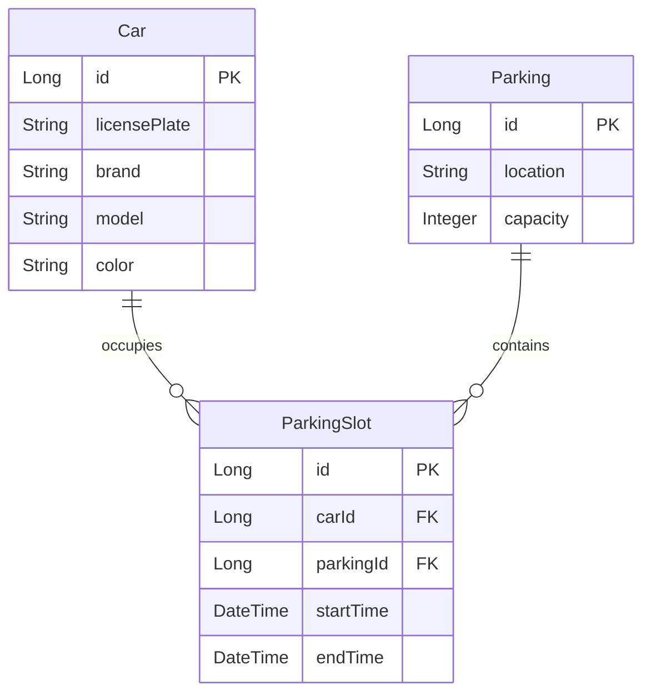

# Parking Lot Management System

This Spring Boot application manages a parking lot system, allowing users to track parked cars and their details.

## Entity Relationship Diagram

## API Documentation

The API documentation is available through Swagger UI at:
- Swagger UI: http://localhost:8080/swagger-ui/index.html
- OpenAPI JSON: http://localhost:8080/v3/api-docs

## Features

- Park a new car
- Remove a car from parking
- List all parked cars
- Find a car by license plate
