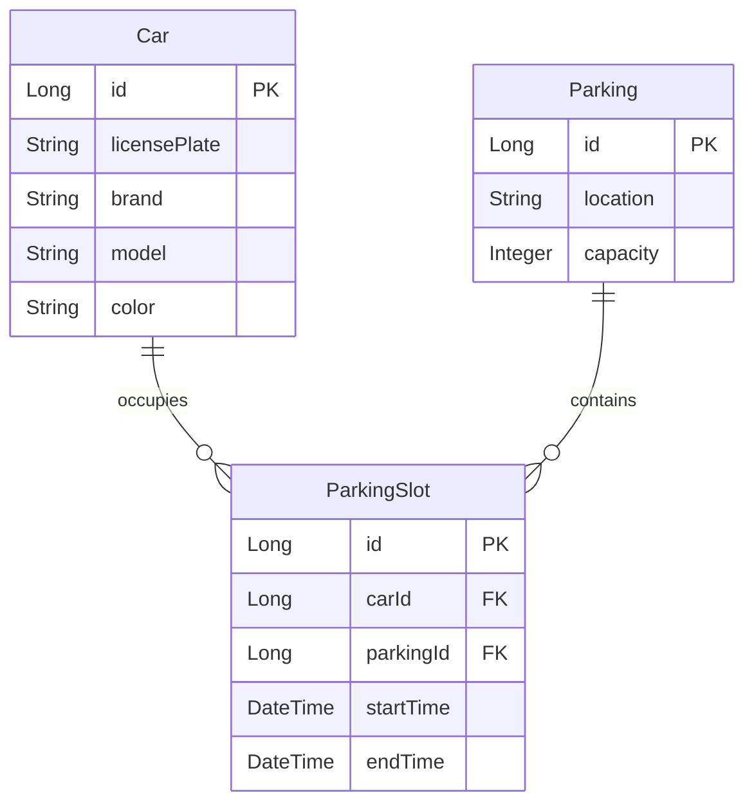

# Parking Lot Management System

This Spring Boot application manages a parking lot system, allowing users to track parked cars and their details.

## Prerequisites

- Java 17 or higher
- Docker and Docker Compose
- Gradle

## Local Development Setup

1. Start the PostgreSQL database using Docker Compose:
   ```bash
   docker-compose up -d
   ```

2. Build the application:
   ```bash
   ./gradlew clean build
   ```

3. Run the application:
   ```bash
   ./gradlew bootRun
   ```

The application will be available at http://localhost:8080

## Database Configuration

The application uses PostgreSQL with the following default configuration:
- Database: mydatabase
- Username: myuser
- Password: secret
- Port: 5432

You can modify these settings in `application.properties` if needed.

## Monitoring

The application includes Spring Boot Actuator endpoints for monitoring:
- Health check: http://localhost:8080/actuator/health
- Metrics: http://localhost:8080/actuator/metrics
- Prometheus metrics: http://localhost:8080/actuator/prometheus

## Entity Relationship Diagram



## API Documentation

The API documentation is available through Swagger UI at:
- Swagger UI: http://localhost:8080/swagger-ui/index.html
- OpenAPI JSON: http://localhost:8080/v3/api-docs

## Features

- Park a new car
- Remove a car from parking
- List all parked cars
- Find a car by license plate
