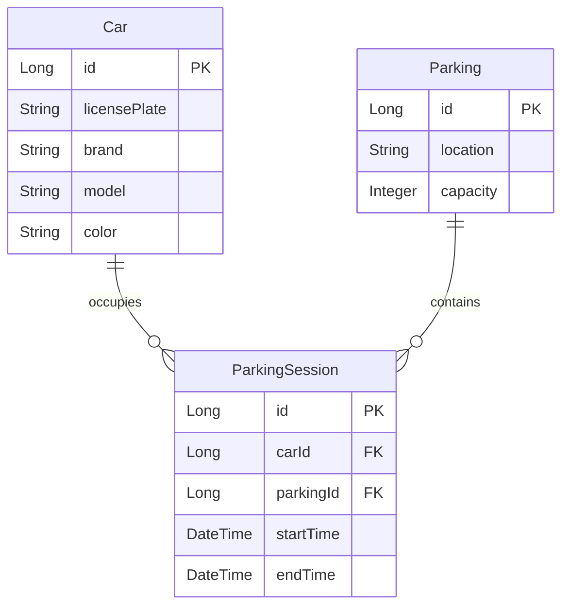

# Parking Lot Management System

This Spring Boot application manages a parking lot system, allowing users to track parked cars and their details.

## Prerequisites

- Java 17 or higher
- Docker and Docker Compose
- Gradle

## Local Development Setup

1. Start the PostgreSQL database using Docker Compose:
   ```bash
   docker-compose up -d
   ```

2. Build the application:
   ```bash
   ./gradlew clean build
   ```

3. Run the application:
   ```bash
   ./gradlew bootRun
   ```

The application will be available at http://localhost:8080

## Database Configuration

The application uses PostgreSQL with the following default configuration:
- Database: mydatabase
- Username: myuser
- Password: secret
- Port: 5432

You can modify these settings in `application.properties` if needed.

## Monitoring

The application includes Spring Boot Actuator endpoints for monitoring:
- Health check: http://localhost:8080/actuator/health
- Metrics: http://localhost:8080/actuator/metrics
- Prometheus metrics: http://localhost:8080/actuator/prometheus

## Entity Relationship Diagram


```mermaid
erDiagram
    Car {
        Long id PK
        String licensePlate
        String brand
        String model
        String color
    }
    Parking {
        Long id PK
        String location
        Integer capacity
    }
    ParkingSession {
        Long id PK
        Long carId FK
        Long parkingId FK
        DateTime startTime
        DateTime endTime
    }
    Car ||--o{ ParkingSession : "occupies"
    Parking ||--o{ ParkingSession : "contains"
```

## API Documentation

The API documentation is available through Swagger UI at:
- Swagger UI: http://localhost:8080/swagger-ui/index.html
- OpenAPI JSON: http://localhost:8080/v3/api-docs

### Car Parking Management System

## Overview
A Hexagonal Architecture based Spring Boot application for managing car parking operations.

## Architecture

### Hexagonal Architecture Overview
This application follows **Hexagonal Architecture** (also known as Ports and Adapters), a design pattern that isolates business logic from external concerns. The core idea is to place business logic at the center, surrounded by adapters that handle external interactions like HTTP requests and database operations.

#### Key Principles:
1. **Independence**: The core application logic is independent of frameworks and external systems
2. **Testability**: Business logic can be tested without external dependencies
3. **Flexibility**: External systems can be swapped without affecting core logic
4. **Maintainability**: Clear separation of concerns makes the codebase easier to maintain

#### Architecture Layers:

**Core Domain Layer** (`domain/`)
- Pure business models: `Car`, `Parking`, `ParkingSession`
- Domain exceptions and value objects
- No dependencies on external frameworks or adapters
- Contains the essential business rules and logic

**Application Layer** (`application/`)
- **Ports**: Define contracts/interfaces for communication (`service/`)
- **Services**: Implement business use cases and orchestration logic
- Coordinates between domain models and adapters
- Handles application-specific logic and workflows

**Input Adapters** (`adapter/in/`)
- **Controllers**: Receive HTTP requests and translate them to service calls
- Convert incoming HTTP requests to domain objects
- Transform domain responses back to HTTP responses
- Handle request validation and error responses

**Output Adapters** (`adapter/out/` and `repository/`)
- **Repositories**: Implement data persistence patterns
- **Mappers**: Convert between domain entities and database entities
- Handle database operations and external service calls
- Translate domain models to/from external data formats

#### Project Structure:
```
src/main/java/com/parking/
├── domain/              # Core business logic (independent)
│   ├── model/          # Domain entities
│   └── exception/      # Domain-specific exceptions
├── application/         # Use cases and orchestration
│   ├── port/           # Port interfaces
│   └── service/        # Business logic services
├── adapter/
│   ├── in/             # Input adapters (controllers)
│   └── out/            # Output adapters
├── repository/          # Data persistence adapters
├── mapper/              # Entity to DTO conversions
└── dto/                 # Data transfer objects
```

#### Benefits:
- **Loose Coupling**: Core business logic doesn't depend on external systems
- **Easy Testing**: Test business logic without mocking external systems
- **Framework Agnostic**: Can change from Spring to another framework without affecting core logic
- **Clear Boundaries**: Easy to understand where each responsibility belongs

## Data Models
- **Car**: Represents a vehicle (id, licensePlate, brand, model, color)
- **Parking**: Represents a parking lot (id, location, capacity, coordinates)
- **ParkingSession**: Represents an active or completed parking stay

## Features
- Dynamic calculation of active sessions to prevent overbooking
- Complete tracking of vehicle entry and exit times
- Track parking duration for each car
- View parking lot occupancy status
- Access historical parking records
