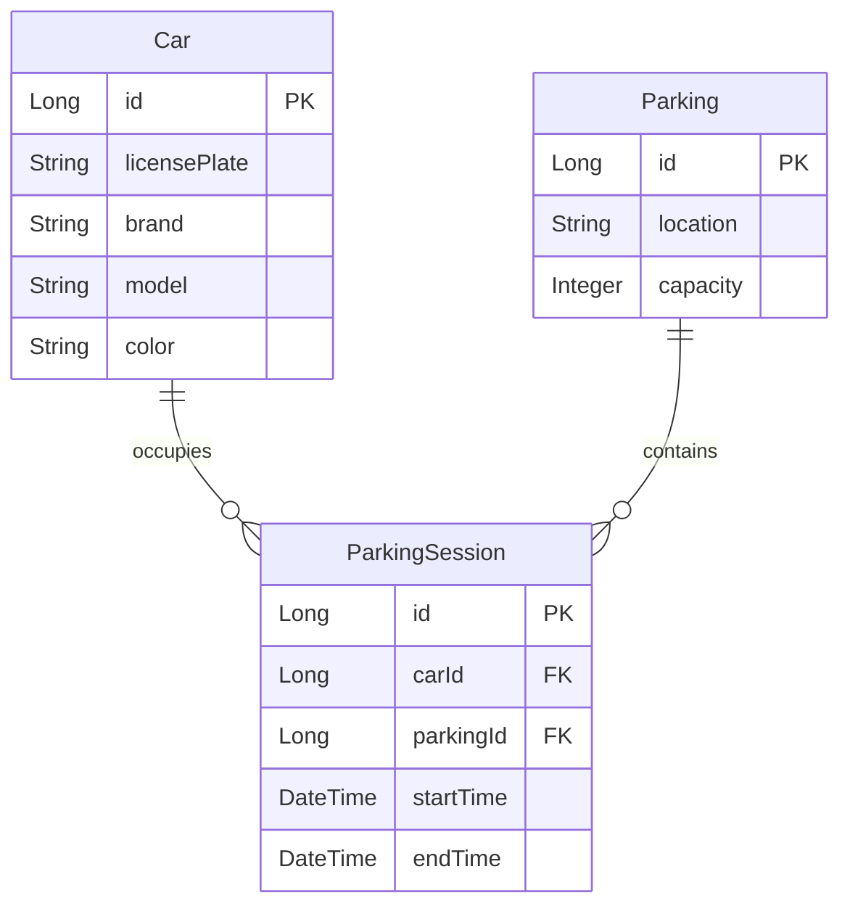

# Parking Lot Management System

This Spring Boot application manages a parking lot system, allowing users to track parked cars and their details.

## Prerequisites

- Java 17 or higher
- Docker and Docker Compose
- Gradle

## Local Development Setup

1. Start the PostgreSQL database using Docker Compose:
   ```bash
   docker-compose up -d
   ```

2. Build the application:
   ```bash
   ./gradlew clean build
   ```

3. Run the application:
   ```bash
   ./gradlew bootRun
   ```

The application will be available at http://localhost:8080

## Database Configuration

The application uses PostgreSQL with the following default configuration:
- Database: mydatabase
- Username: myuser
- Password: secret
- Port: 5432

You can modify these settings in `application.properties` if needed.

## Monitoring

The application includes Spring Boot Actuator endpoints for monitoring:
- Health check: http://localhost:8080/actuator/health
- Metrics: http://localhost:8080/actuator/metrics
- Prometheus metrics: http://localhost:8080/actuator/prometheus

## Entity Relationship Diagram


```mermaid
erDiagram
    Car {
        Long id PK
        String licensePlate
        String brand
        String model
        String color
    }
    Parking {
        Long id PK
        String location
        Integer capacity
    }
    ParkingSession {
        Long id PK
        Long carId FK
        Long parkingId FK
        DateTime startTime
        DateTime endTime
    }
    Car ||--o{ ParkingSession : "occupies"
    Parking ||--o{ ParkingSession : "contains"
```

## API Documentation

The API documentation is available through Swagger UI at:
- Swagger UI: http://localhost:8080/swagger-ui/index.html
- OpenAPI JSON: http://localhost:8080/v3/api-docs

### Car Parking Management System

## Overview
A Hexagonal Architecture based Spring Boot application for managing car parking operations.

## Architecture
The application is structured using Hexagonal Architecture (Ports and Adapters) to separate concerns:
- **Domain**: Pure business models (`Car`, `Parking`, `ParkingSession`)
- **Application**: Business logic and use cases (`CarService`)
- **Adapters In**: Controllers handling HTTP requests
- **Adapters Out**: Repositories and Entity mapping for database access

## Data Models
- **Car**: Represents a vehicle (id, licensePlate, brand, model, color)
- **Parking**: Represents a parking lot (id, location, capacity, coordinates)
- **ParkingSession**: Represents an active or completed parking stay

## Features
- Dynamic calculation of active sessions to prevent overbooking
- Complete tracking of vehicle entry and exit times
- Track parking duration for each car
- View parking lot occupancy status
- Access historical parking records
